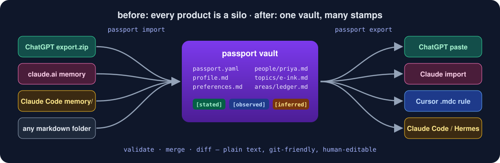
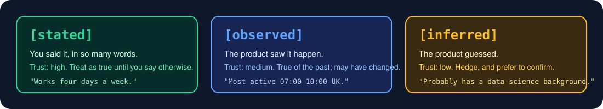
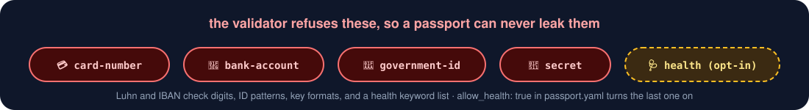

<p align="center">
  
</p>

<p align="center">
  <a href="https://github.com/mohitagw15856/memory-passport/actions/workflows/ci.yml"></a>
  
  
  <a href="LICENSE"></a>
  
</p>

<h3 align="center">Every assistant remembers you. None of them will tell the others.</h3>

<p align="center">
ChatGPT knows you're vegetarian. Claude knows about the ledger rewrite. Cursor knows you hate semicolons.<br>
Switch products and you start from zero. <b>memory-passport</b> is a plain-text format, a spec, and a CLI that moves it all.
</p>

<p align="center">
  
</p>

## ⏱️ 60-second quickstart

```bash
pip install memory-passport            # or: uv tool install memory-passport

# 1. Turn a ChatGPT data export into a vault (memories are hiding inside conversations.json)
passport import chatgpt-export.zip --out passport

# 2. Check it against the spec
passport validate passport

# 3. Paste it into Claude (Settings → Memory → Start import)
passport export passport --to claude | pbcopy
```

That is the whole loop. Your vault is a folder of markdown files you can read, edit, and commit to git.

<p align="center">
  
</p>

## 🗂️ What a passport looks like

```
passport/
├── passport.yaml          # spec_version, allow_health
├── profile.md             # who you are
├── preferences.md         # how you like assistants to behave
├── people/priya-nair.md   # one file per person
├── topics/e-ink-devices.md
└── areas/ledger-rewrite.md   # one file per project
```

Every file is YAML frontmatter plus bullet lines. Every bullet says **where it came from**:

```markdown
---
name: Priya Nair
description: Sam's manager; sets quarterly priorities and reviews design docs.
sources: [chatgpt, claude]
aliases: [Priya, PN]
updated: "2026-06-11"
kind: person
---

- [stated] Prefers decisions written up as one-page ADRs before a meeting.
- [inferred] Likely based in the Edinburgh office, given meeting times. <!-- src: chatgpt, 2026-05-02 -->
```

<p align="center">
  
</p>

No product records provenance today. They should. Until they do, the importers tag conservatively and the exporters hedge anything that was only a guess ("Possibly: …") so a wrong inference never gets promoted to fact on the way in to the next assistant.

## 🚫 What a passport refuses to carry

A passport is designed to be pasted into many products, so it is the worst possible place for anything you would not hand to a third party. The validator rejects these outright:

<p align="center">
  
</p>

Importers drop matching facts and tell you. Health is the one opt-in category (`--allow-health`), because an assistant that knows about your dietary restriction is genuinely more useful. The rest have no everyday use. Full reasoning in [SPEC.md §7](SPEC.md#7-excluded-categories).

<p align="center">
  
</p>

## 🔀 Merge without losing, diff without squinting

Two vaults from two products will disagree. `merge` never picks silently: the same fact with different tags keeps the more trusted one, new facts are added, and contradictions get git-style conflict markers that fail validation until you resolve them.

<p align="center">
  
</p>

```bash
passport diff vault-a vault-b            # + added, - removed, ~ retagged
passport merge vault-a vault-b --out merged
```

## 🧭 Every command

| Command | What it does |
|---|---|
| `passport validate <dir> [--strict] [--json]` | Check a vault against the spec. Exit 1 on errors. |
| `passport import <export> [--from chatgpt\|claude\|markdown] [--out dir]` | Build a vault. Auto-detects the source when it can. |
| `passport import … --memory-text memories.txt` | Combine an export with a pasted memory list. |
| `passport import … --no-route` | Skip the people/topics/areas sorting; everything in `profile.md`. |
| `passport export <dir> --to chatgpt\|claude\|claude-code\|cursor\|markdown [--out path]` | Paste-ready text or files for that product. |
| `passport merge <a> <b> --out merged` | Merge with conflict markers. Exit 3 if any conflicts. |
| `passport diff <a> <b> [--json]` | Fact-level diff. Exit 1 if they differ. |
| `passport importers` / `passport exporters` | List what is installed, including plugins. |

## 🧳 Where the memories actually are

Getting memory *out* of products is the annoying part. Here is what each one really offers, and what the passport does with it.

| Product | Export exists? | Import exists? | Where memory hides | Provenance | Per-subject structure | Hand-editable | Sensitive-data control |
|---|---|---|---|---|---|---|---|
| **ChatGPT** | Data export zip, but no memory file. Memories are recoverable from `conversations.json` as messages to the `bio` tool, or copy the *Manage memories* list. | No. Custom instructions (2 × 1,500 chars) or "remember this" in chat. | flat list of sentences | none | none | via settings UI only | delete individual memories |
| **Claude** (claude.ai) | Copy from *Settings → Memory*, or ask it to write memories out verbatim. Data export has projects but no memory. | Yes: *Settings → Memory → Start import* (experimental). | prose summary | none | by topic in the summary | edit the summary text | "include sensitive topics" toggle |
| **Claude Code** | It is already files: `~/.claude/projects/<p>/memory/*.md` with frontmatter. | Drop files in the folder. | markdown files | none, but a `type` field | one file per memory | yes | none |
| **Cursor** | No user memory; project rules in `.cursor/rules/*.mdc`. | Write a rule file. | rule files per repo | none | per repo | yes | none |
| **Gemini** | No export. | No. | Saved Info list | none | none | via settings UI | delete individual items |
| **Hermes Agent / custom bots** | Whatever you built; usually a markdown folder. | Same. | your call | your call | your call | yes | your call |
| **memory-passport** | It *is* the export. | It *is* the import. | `profile.md`, `preferences.md`, `people/`, `topics/`, `areas/` | `[stated]` `[observed]` `[inferred]` + per-fact source and date | one file per subject, five kinds | yes, it is markdown | validator refuses cards, IDs, secrets; health opt-in |

Corrections welcome. Products change their exports without notice; each importer's module docstring says exactly which fields it reads, and the fixtures in `tests/fixtures/` mirror the real layouts.

## 🔌 Pluggable

Adding a product is one class with `detect()` and `load()`, registered as an entry point. No fork needed:

```toml
[project.entry-points."memory_passport.importers"]
acme = "passport_acme:AcmeImporter"
```

`passport import --from acme` will find it. The walkthrough is in [CONTRIBUTING.md](CONTRIBUTING.md).

## 📐 The spec

[SPEC.md](SPEC.md) defines the layout, the frontmatter (with a [JSON Schema](spec/frontmatter.schema.json)), fact lines, the three tags, the exclusions and why, merge semantics, and what the format deliberately cannot express. [docs/ADR-001.md](docs/ADR-001.md) explains why markdown plus frontmatter beat JSON.

The `examples/sample-vault/` folder is a complete, valid vault to poke at.

## 🛠️ Developing

```bash
git clone https://github.com/mohitagw15856/memory-passport && cd memory-passport
uv sync --group dev
uv run pytest -q          # 55 tests, fixture exports for every importer
uv run ruff check .
```

## 📜 Licence

MIT © [mohitagw15856](https://github.com/mohitagw15856). Your memories are yours; this just helps them travel.
